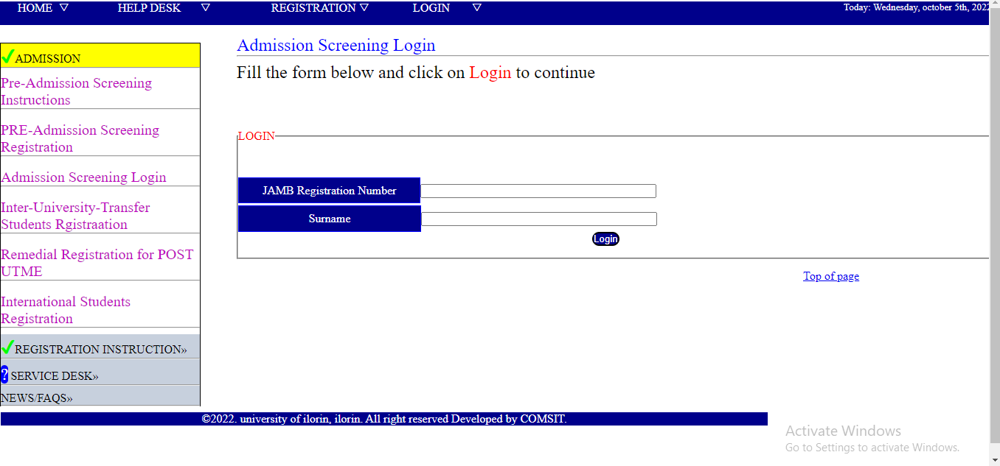

# unilorin-page
*An implementation of unilorin-page clone with html and css*
## Prequisite
- Your browser version should be up to date for better experience
## Features
- Home page
- Admission screening page
- Remedial registration page
- International student page
- Admission login page
- Pre-admission login page
- Admission screening page
- Pre-admission screening page
## Tech/framework used
- Html
- Css
## Preview here
[Demo](https://rawcdn.githack.com/Intelligence247/unilorin-page/a2a81cc7551d5232504bd8422a7f49e2b3e3c62b/index.html)

## Contact
If you want to contact me you can reach me at
- https://github.com/Intelligence247 or
- uthmanabdullahi2020@gmail.com
## Addtional Info
- This is one of the series of project for the @CodeVillage.org
- This is not meant for production. It's for learning purpose only
